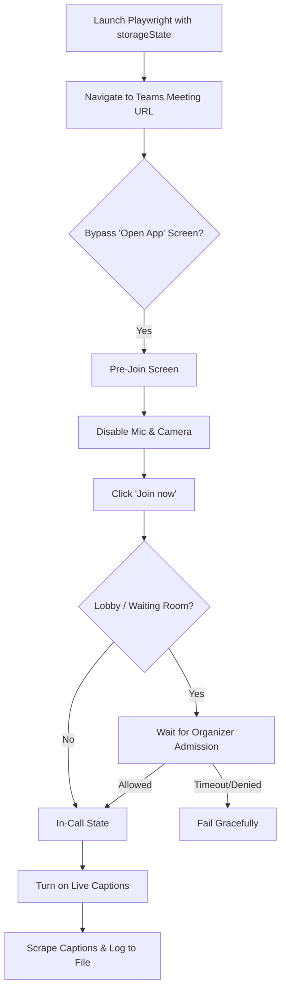

# Implementation Plan — Microsoft Teams Bot

Implement an independent Microsoft Teams meeting bot that handles session persistence (auth.json), automated meeting join, live caption scraping, and transcript logging.

## Proposed File & Folder Structure

Inside the `Microsoft Teams` root folder:

```
Microsoft Teams/
├── package.json
├── package-lock.json
├── config.js                 # Selectors, timeouts, and env variable parsing
├── auth.json                 # Saved Playwright storage state (git-ignored)
└── src/
    ├── index.js              # Entrypoint (CLI args, orchestrator run)
    ├── bot.js                # TeamsBot class (browser launch, join flow, meeting lifecycle)
    ├── captions.js           # CaptionScraper class (enabling captions, DOM MutationObserver)
    └── output.js             # TranscriptLogger class (writes to transcript.jsonl)
```

---

## Technical Approach & Selectors

Teams Web App has complex, dynamic layouts. We will use robust selector patterns matching modern Teams UI:

1. **Bypassing the "Open in app?" landing page**:
   * Selector: `button#openTeamsClient`, `button:has-text("Use Teams on the web")`, `button[data-tid="joinOnWeb"]`.
   * Action: Wait for these buttons and click the browser-join path, or directly bypass by intercepting the browser navigation behavior if possible.

2. **Pre-Join Screen Cam/Mic Toggles**:
   * Camera toggle: `button[role="checkbox"][aria-label*="video" i]`, `button[aria-label*="camera" i]`, `div[role="button"][aria-label*="camera" i]`.
   * Microphone toggle: `button[role="checkbox"][aria-label*="microphone" i]`, `button[aria-label*="mic" i]`, `div[role="button"][aria-label*="microphone" i]`.
   * Toggle state verification: Check `aria-checked` attribute. If it's `"true"`, click it to toggle off. We can also use standard Teams keyboard shortcuts (e.g. `Ctrl+Shift+O` for video, `Ctrl+Shift+M` for microphone).

3. **Pre-Join Submit**:
   * Join button: `button:has-text("Join now")`, `button[data-tid="prejoin-join-button"]`.
   * Action: Wait for selector to be visible and click it.

4. **Lobby / Waiting Room**:
   * Indicators: Text elements containing `"waiting for the organizer"`, `"Someone in the meeting should let you in soon"`, or class/test selectors like `div[data-tid="lobby-screen"]`.
   * Action: Periodically verify if the lobby state is active. If active, log progress and wait. Define a configurable timeout (e.g., 5 minutes) before failing.

5. **In-Call (Successful Entry)**:
   * Verification: Presence of the calling screen `div[data-tid="meeting-calling-screen"]`, active call controls toolbar, or the Leave/Hangup button (`button[data-tid="hangup-button"]`, `button[aria-label*="Hang up" i]`, `button[aria-label*="Leave" i]`).

6. **Activating Live Captions**:
   * Flow:
     1. Click "More" actions button (`button[aria-label*="More" i]`, `button[data-tid="more-actions-button"]`, `button#callingButtons-more-button`).
     2. Wait for the dropdown menu.
     3. Select "Language and speech" / "Turn on live captions" (`button[aria-label*="live captions" i]`, `button:has-text("Turn on live captions")`).
     4. Alternatively, try key shortcut trigger (`Ctrl+Shift+C`) if supported in browser layout.

7. **Live Captions DOM Scraping**:
   * Captions container: `div[data-tid="captions-container"]`, `div.captions-render-area`, or elements with class name containing `captions`.
   * Individual caption blocks contain:
     * Speaker element: A header or element containing the speaker's name/avatar.
     * Text elements: The text segments updated in real-time.
   * Action: A `MutationObserver` on the captions container. We will detect addition of new caption blocks or updates to existing ones.

---

## Session Save/Reuse Flow (auth.json)

1. **Generation (Manual Login)**:
   * Execute the bot with the `--login` flag.
   * Playwright launches a headed (visible) browser pointing to the Microsoft Teams login page (`https://teams.microsoft.com`).
   * The user enters their credentials and performs MFA.
   * Once logged in and viewing the main Teams dashboard, the user presses ENTER in the Node terminal.
   * Playwright calls `context.storageState({ path: './Microsoft Teams/auth.json' })`.
   * The browser is closed.

2. **Reuse**:
   * On normal execution, the bot checks if `auth.json` exists.
   * If it does, Playwright is initialized with `{ storageState: './Microsoft Teams/auth.json' }`.
   * The browser will launch directly with the logged-in session, skipping the login screen and going straight to the meeting URL.

---

## Join Flow State Machine



---

## Shape of Caption Events & Output Format

Captions scraped from the DOM will be serialized to `transcript.jsonl` in the following JSON format:

```json
{
  "timestamp": "2026-07-06T11:00:14.123Z",
  "speaker": "John Doe",
  "text": "Hello everyone, welcome to the meeting."
}
```

We will implement a streaming file logger (`TranscriptLogger`) that opens the file in append-mode and writes one line per finalized utterance.

---

## Implementation Order

We will build the bot incrementally, pausing for review and confirmation after each step:

1. **Step 1: Session save/reuse** — Implement the CLI `--login` flow and verify generation of `auth.json`.
2. **Step 2: Automated Join** — Implement URL parsing, landing page bypass, mic/cam disabling, lobby handling, and successful in-call confirmation.
3. **Step 3: Enable and Scrape Live Captions** — Implement menu automation to turn on captions and the `MutationObserver` caption scraper.
4. **Step 4: Graceful Edge Case Handling** — Build resilience for lobby timeouts, being removed, meeting end, and network disconnects.
5. **Step 5: Output Wiring** — Integrate the transcript logger writing to `transcript.jsonl` with accurate timestamps.

---

## Open Questions & Assumptions

1. **Lobby Wait Time**: We assume a default lobby wait timeout of 5 minutes. If not admitted by then, we will log a warning and shut down.
2. **Selector Fragility**: Teams DOM changes frequently. We will centralize selectors in `config.js` with descriptions so they are easily updatable.
3. **Muted Bot participant**: The bot will always join muted and with the camera off.
