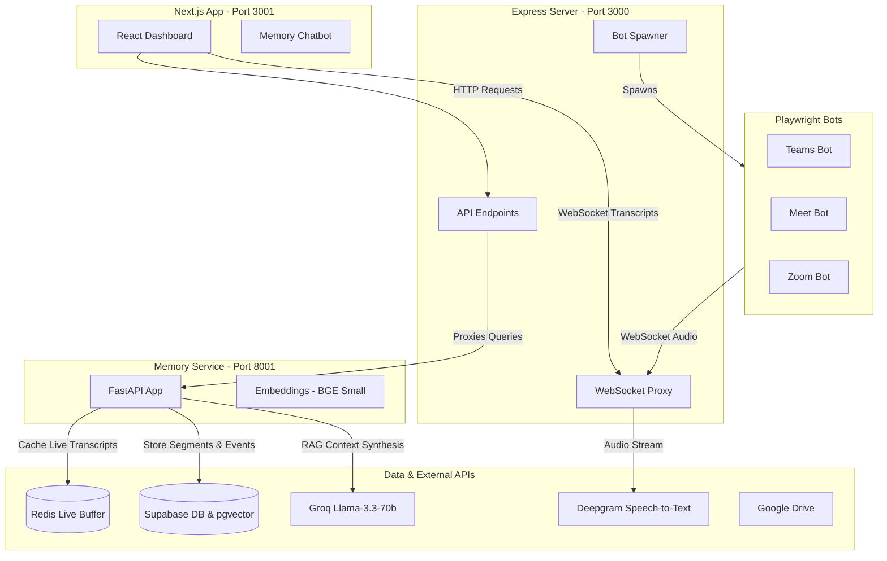

# Centralized Meeting Bots & Transcription Dashboard

This repository contains a centralized orchestration dashboard and automation bots for **Microsoft Teams**, **Google Meet**, and **Zoom**. It automates joining meetings, extracting transcripts/live captions, generating AI summaries (reports, speaker analytics, and Microsoft Word document exports), and syncing files to Supabase Storage and Google Drive folders.

Additionally, it integrates a **Python-based Memory Service** that enables persistent meeting memory (RAG) and direct conversational queries over meeting history through a chat assistant.

---

## System Architecture

The project consists of three main services interacting with each other, external APIs, and the database:



---

## Folder Structure

* **`Microsoft Teams/`**: Playwright-based Teams bot that bypasses app landing pages, toggles off camera/microphone switches, and utilizes a robust DOM-based caption scraper with a `MutationObserver`.
* **`Google Meet/`**: Playwright-based Google Meet bot that intercepts WebRTC `RTCPeerConnection` natively to mix and downsample meeting audio, mapping active speakers via DOM speaker indicators.
* **`Zoom/`**: Playwright-based Zoom Web Client bot that streams audio buffers to the server.
* **`dashboard/`**:
  * **`frontend/`**: A modern **Next.js** web application (runs on port **`3001`**) built with React, Tailwind CSS, and Lucide Icons. It hosts the dashboard interface, live caption feed, active session indicators, Google Calendar scheduler, and the memory chat assistant.
  * **`backend/`**: An Express.js server (runs on port **`3000`**) that spawns the bots as child processes, exposes a WebSocket proxy, manages Deepgram transcription streams, generates Word Document summaries (`docx` library), and handles Google Drive OAuth2 flows.
* **`memory-service/`**: A **Python FastAPI service** (runs on port **`8001`**) providing meeting memory rollup and retrieval. It embeds transcripts using a sentence-transformer (`bge-small-en-v1.5`), stores them in Supabase (PostgreSQL with `pgvector`), and uses Redis as a hot buffer for active meetings.

---

## Prerequisites

1. **Node.js**: Version 18 or higher is recommended.
2. **Python**: Version 3.11 or higher (for the memory service).
3. **Redis**: Running instance on localhost (port `6379`) for hot buffer storage during live meetings.
4. **Google Chrome**: Real Google Chrome installation is required on the host system to run bots under the `--channel chrome` flag.
5. **Playwright**: Browser dependencies must be installed.
6. **Google Cloud Console Project**: Needed to configure client credentials for Google Drive and Google Calendar integrations.

---

## 1. Environment Configuration

Create a `.env` file in the **root folder** of the project and populate the following variables:

```ini
# Deepgram API Key (Required for Zoom & Google Meet audio transcription)
DEEPGRAM_API_KEY="your_deepgram_api_key"

# Groq API Key (Required for AI report generation & RAG context synthesis)
GROQ_API_KEY="your_groq_api_key"

# Gemini API Key (Optional / LLM fallback)
GEMINI_API_KEY="your_gemini_api_key"

# Supabase Configurations (Required for database session state & cloud storage)
SUPABASE_URL="https://your-project.supabase.co"
SUPABASE_ANON_KEY="your_supabase_anon_key"

# Google OAuth2 Credentials (Required for Google Drive & Calendar Sync)
GOOGLE_CLIENT_ID="your_google_client_id.apps.googleusercontent.com"
GOOGLE_CLIENT_SECRET="your_google_client_secret"
GOOGLE_REDIRECT_URI="http://localhost:3000/api/auth/google/callback"

# Memory Service Port Configuration (Optional, defaults to 8001)
MEMORY_SERVICE_PORT=8001
REDIS_URL="redis://localhost:6379"
```

---

## 2. Installation

### Node.js Workspace Dependencies
Install dependencies across all Node.js workspace directories (Bots and Backend) in a single command from the root folder:

```bash
# Install dependencies for Node.js projects
npm install
```

Make sure browser drivers are installed via Playwright:
```bash
npx playwright install chrome
```

### Next.js Frontend Dependencies
Install dependencies for the Next.js app:
```bash
cd dashboard/frontend
npm install
cd ../..
```

### Python Memory Service Dependencies
Ensure you have `uv` installed, or use standard virtual environments to install Python packages:

```bash
cd memory-service
uv sync
# Or: python -m venv .venv && source .venv/bin/activate && pip install -r pyproject.toml
cd ..
```

---

## 3. First-Time Bot Authentication (First-time Login)

To ensure the bots can access meetings under authenticated accounts, you must run the login setup once before running them in the background.

* **Google Meet Bot:**
  Run the following command to log in manually. This opens a headful browser and saves the persistent `auth.json` file:
  ```bash
  cd "Google Meet"
  node src/index.js --login
  ```
  *(Log in in the browser, then return to the terminal and press ENTER to save the session).*

* **Microsoft Teams Bot:**
  Run the following command to log in manually. This creates the persistent `auth.json` file:
  ```bash
  cd "Microsoft Teams"
  node src/index.js --login
  ```
  *(Log in in the browser, then return to the terminal and press ENTER to save the session).*

---

## 4. Running the Project

To run the entire system, you will need to run the following services concurrently:

### A. Start Redis
Make sure a local Redis server is running:
```bash
# macOS/Linux
redis-server

# Windows (via WSL or native installer)
redis-server.exe
```

### B. Start the Python Memory Service
Start the FastAPI server from the `memory-service/` directory:
```bash
cd memory-service
uv run uvicorn app.main:app --host 0.0.0.0 --port 8001
```
The memory service will run at `http://localhost:8001`.

### C. Start the Centralized Backend Server
Start the Express API/WebSockets server from the `dashboard/backend/` directory:
```bash
cd dashboard/backend
npm start
```
The backend server will run at `http://localhost:3000`.

### D. Start the Next.js Frontend
Start the React dashboard in development mode from the `dashboard/frontend/` directory:
```bash
cd dashboard/frontend
npm run dev
```
The Next.js application will run at **`http://localhost:3001`**. Open this URL in your web browser to access the control panel.

---

## 5. Platform Bot Execution Details

### A. Microsoft Teams Bot
* **Mechanism**: Automates anonymous guest joining. Utilizes custom script injections to spoof `document.visibilityState` to `'visible'` (avoiding headless loader freezes), toggles FluentUI camera/microphone selectors, and observes `.fui-ChatMessageCompact` blocks for live caption strings.
* **Requirements**: Captions **must** be enabled on the host side of the meeting for transcription to work. The bot will automatically trigger "Turn on live captions" inside the meeting.

### B. Google Meet Bot
* **Mechanism**: Intercepts the RTCPeerConnection to stream meeting audio to Node.js, downsamples PCM to 16kHz, and uploads it to the Deepgram API for transcription. 
* **Speaker Detection**: Polls the DOM for `.KUNJSe` classes to detect active speaker boundaries.

### C. Zoom Bot
* **Mechanism**: Connects to the Zoom meeting via the web client, intercepts audio channels, and streams data over WebSockets for backend Deepgram transcription.

---

## 6. Integrations & Integrations Setup

### Google Drive & Calendar Sync
To automatically schedule meetings and save raw transcripts (`.jsonl`), timestamped readable transcripts (`_readable.txt`), and summaries (`_report.md` & `_report.docx`) to your Google Drive folders:

#### GCP Project Setup
1. Go to the [Google Cloud Console](https://console.cloud.google.com/).
2. Enable the **Google Drive API** and **Google Calendar API** in your project:
   * Navigate to **API & Services > Library**.
   * Search for `Google Drive API` and click **Enable**.
   * Search for `Google Calendar API` and click **Enable**.
3. Configure the **OAuth Consent Screen**:
   * Set user type and register your app.
   * Add the scope: `https://www.googleapis.com/auth/drive.file` and `https://www.googleapis.com/auth/calendar.events` (for scheduling).
4. Create **Credentials**:
   * Create an OAuth 2.0 Client ID.
   * Set Authorized Redirect URIs to: `http://localhost:3000/api/auth/google/callback`.
   * Add the Client ID, Secret, and Redirect URI to your root `.env` file.

#### Syncing in Dashboard
1. Open the Next.js dashboard homepage (`http://localhost:3001/`).
2. Click **Connect Google Drive** on the left panel.
3. Authenticate and approve the scopes on Google's consent page.
4. Once redirected back, the status badge will update to **Connected**.
5. When starting a bot session, paste a folder link (e.g. `https://drive.google.com/drive/folders/FOLDER_ID`) in the **Google Drive Folder URL (optional)** text input.
6. The transcripts and reports will automatically sync to that folder on session completion!
