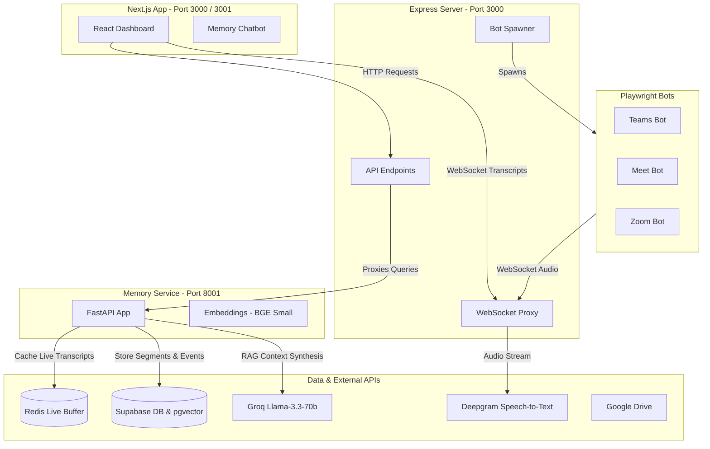

# Centralized Meeting Bots & Transcription Dashboard

This repository contains a centralized orchestration dashboard and automation bots for **Microsoft Teams**, **Google Meet**, and **Zoom**. It automates joining meetings, extracting transcripts/live captions, generating AI summaries (reports, speaker analytics, and Microsoft Word document exports), and syncing files to Supabase Storage and Google Drive folders.

Additionally, it integrates a **Python-based Memory Service** that enables persistent meeting memory (RAG) and direct conversational queries over meeting history through a chat assistant.

---

## System Architecture

The project consists of three main services interacting with each other, external APIs, and the database:



---

## Quick Start (PowerShell - 1-Step Setup & Launch)

For Windows / PowerShell users, central installation and multi-service launching are fully automated via PowerShell scripts:

### 1️⃣ One-Step Installation
Run the central installation script to install all dependencies for Backend, Frontend, Playwright Bots, Chromium binaries, and Python Memory Service:

```powershell
.\install.ps1
```

### 2️⃣ One-Step Multi-Service Launch
Launch all 3 central services (Backend API, Next.js Frontend, and Python Memory Service) simultaneously:

```powershell
# Launches Backend, Frontend, and Memory Service in separate terminal windows
.\start.ps1

# Optional: Run all services in background PowerShell jobs
.\start.ps1 -Background
```

---

## Folder Structure

* **`Microsoft Teams/`**: Playwright-based Teams bot that bypasses app landing pages, toggles off camera/microphone switches, and utilizes a DOM-based caption scraper.
* **`Google Meet/`**: Playwright-based Google Meet bot that intercepts WebRTC `RTCPeerConnection` natively to mix audio, mapping active speakers via DOM indicators.
* **`Zoom/`**: Playwright-based Zoom Web Client bot that streams PCM audio chunks directly to the server proxy.
* **`dashboard/`**:
  * **`frontend/`**: Modern **Next.js** web application (runs on port **`3000`** / **`3001`**) built with React and Tailwind CSS. Features live meeting modal, real-time transcripts, Google Drive integration, and AI Q&A assistant.
  * **`backend/`**: Express.js server (runs on port **`3000`**) that manages child bot processes, WebSocket streaming, Supabase storage, Word Document export, and Google Calendar auto-join webhooks.
* **`memory-service/`**: **Python FastAPI service** (runs on port **`8001`**) providing meeting memory rollup, sentence embeddings (`bge-small-en-v1.5`), and Groq LLM RAG context synthesis.

---

## Environment Configuration

Copy the template configuration to `.env` in the project root folder:

```powershell
cp .env.example .env
```

Populate the required credentials in `.env`:

```ini
# Deepgram API Key (Required for Zoom & Google Meet audio transcription)
DEEPGRAM_API_KEY="your_deepgram_api_key"

# Groq API Key (Required for AI report generation & RAG context synthesis)
GROQ_API_KEY="your_groq_api_key"

# Gemini API Key (Optional / LLM fallback)
GEMINI_API_KEY="your_gemini_api_key"

# Supabase Configurations (Required for database session state & cloud storage)
SUPABASE_URL="https://your-project.supabase.co"
SUPABASE_ANON_KEY="your_supabase_anon_key"

# Google OAuth2 Credentials (Required for Google Drive & Calendar Sync)
GOOGLE_CLIENT_ID="your_google_client_id.apps.googleusercontent.com"
GOOGLE_CLIENT_SECRET="your_google_client_secret"
GOOGLE_REDIRECT_URI="http://localhost:3000/api/auth/google/callback"

# Google Calendar OAuth2 Credentials (Required for Google Calendar Auto-Join)
GOOGLE_CALENDAR_CLIENT_ID="your_google_calendar_client_id.apps.googleusercontent.com"
GOOGLE_CALENDAR_CLIENT_SECRET="your_google_calendar_client_secret"
GOOGLE_CALENDAR_REDIRECT_URI="http://localhost:3000/api/calendar/auth/callback"

# Public Backend URL for Webhooks (e.g. Ngrok tunnel URL)
PUBLIC_BACKEND_URL="https://your-ngrok-tunnel.ngrok-free.dev"
```

---

## First-Time Bot Authentication (Google Account Login)

To save persistent browser credentials so Google Meet bots join without requiring manual sign-in each time:

```powershell
cd "Google Meet"
node src/index.js --login
```
1. Sign in to your Google Account in the opened Chrome window.
2. Return to the terminal and press **ENTER** to save your authenticated session profile.

---

## Manual Step-by-Step Installation & Launch (Alternative)

If you prefer to install and run each service manually instead of using `install.ps1` and `start.ps1`:

### Installation
```bash
# 1. Install Node.js Dependencies
npm install
cd dashboard/backend && npm install && cd ../..
cd dashboard/frontend && npm install && cd ../..
cd "Google Meet" && npm install && cd ..
cd Zoom && npm install && cd ..
cd "Microsoft Teams" && npm install && cd ..

# 2. Install Playwright Chromium
npx playwright install chromium

# 3. Install Python Memory Service Dependencies
cd memory-service
uv sync
```

### Manual Execution (3 Separate Terminals)

* **Terminal 1 (Dashboard Backend):**
  ```bash
  cd dashboard/backend
  npm start
  ```

* **Terminal 2 (Dashboard Frontend):**
  ```bash
  cd dashboard/frontend
  npm run dev
  ```

* **Terminal 3 (Python Memory Service):**
  ```bash
  cd memory-service
  uv run serve
  ```

---

## Active Endpoints

* 🌐 **Frontend Dashboard**: `http://localhost:3000` (or `http://localhost:3001`)
* ⚙️ **Backend Express Server**: `http://localhost:3000`
* 🧠 **Python Memory Service**: `http://localhost:8001`
