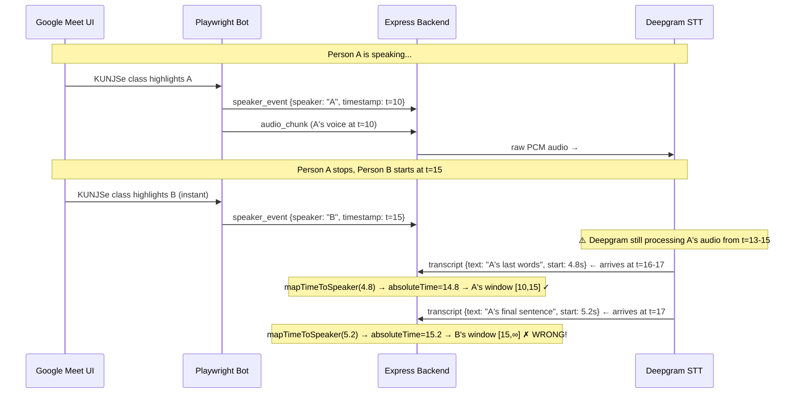

# Speaker Attribution Lag Fix — Implementation Plan

## Root Cause Analysis

Your system has **two independent data streams** with different latencies:



### The 3 sources of lag that cause misattribution:

1. **Deepgram processing latency (~1-3s):** Audio captured at t=14 may produce a transcript result at t=16-17 with `start=4.0`. The speaker boundary has already moved to B by the time the result arrives.

2. **Deepgram utterance segmentation:** Deepgram may segment A's last words into a result whose `start` timestamp lands slightly AFTER the speaker boundary, even though the audio was from A.

3. **The "upcoming speaker" bias in the current code (section 2a):** When a timestamp falls in a gap, the code actively looks for the NEXT speaker and attributes to them. This is exactly backwards — it turns a 1-chunk lag into a 3-5 chunk lag.

---

## How Fireflies / Otter.ai / Vexa Handle This

Professional transcription services use a **"previous speaker grace period"** strategy:

> When a speaker transition is detected at time T, continue attributing transcriptions to the **previous speaker** for an additional 2-3 seconds. This absorbs the STT processing latency completely.

The logic is simple: if Deepgram returns a result with a timestamp near a speaker boundary, it's virtually **always** from the previous speaker (because of processing lag), never from the upcoming one.

### Reference implementation: Vexa `ClusterNameBinder` (from github.com/Vexa-ai/vexa)

Vexa's open-source stack has **two pipelines** that map directly onto our architecture:

- **`gmeet-pipeline`** — captures **per-channel audio** (each participant is a separate `<audio>` element) and stamps each chunk with the glow name at the source. Speaker identity is *bound at capture*, no diarizer, no post-hoc naming. **This is not our case** — we capture one mixed stream.
- **`mixed-pipeline`** — exactly our case: **one mixed audio stream + DOM speaker hints**. This is the one to study. Its namer is `ClusterNameBinder` (`core/meetings/modules/mixed-pipeline/src/cluster-name-binder.ts`), and it is the reference for our fix.

Our system (Playwright bot + `KUNJSe` speaker-name scrape + Deepgram on mixed audio) is structurally identical to Vexa's `mixed-pipeline`: a single mixed audio stream, a platform UI hint stream (our `KUNJSe` scrape ≈ Vexa's `'dom-active'` Zoom hint), and an STT engine with processing latency. Vexa's `ClusterNameBinder` is therefore the authoritative solution pattern.

#### Key mechanisms from `ClusterNameBinder` (verbatim from source)

1. **Per-kind lag correction.** Each hint source has a known latency; hint timestamps are shifted *back* by that amount before matching:

   ```ts
   const KIND_LAG_MS = { 'dom-active': 250, 'caption': 1000, 'dom-outline': 200 };
   // on recordHint: const t = ev.tMs - this.lag[ev.kind];
   ```

   Our `KUNJSe` scrape is a DOM active-speaker hint → model it as `dom-active` with a measured lag (~250 ms baseline; **measure live** — see Verification). This alone fixes the "name observed at t=15 matched against audio that was actually t=14.8" problem.

2. **Overlap-window match, NOT point lookup.** Instead of "which speaker owns timestamp X", Vexa asks "which name's *turn* overlaps the transcript's audio span the most (in overlap-ms)". It aggregates overlap per name across all hint turns:

   ```ts
   const o = Math.min(turnEnd, windowEnd) - Math.max(turn.tStartMs, windowStart); // overlap-ms
   ```

   Our `mapTimeToSpeaker` currently does a point-in-window lookup (`absoluteTimeSec >= c.start_ts && <= c.end_ts`). That point lookup is the fragile primitive that lets one late chunk slip across a boundary.

3. **RECENCY TIE-BREAKER — this is our exact bug.** When two names are within `RECENCY_TIE_MS` (1000 ms) of overlap, the **more recent hint wins**:

   ```ts
   // on a near-tie, the MORE RECENT hint wins — so a previous speaker's still-open
   // turn can't out-vote the speaker who actually just started.
   if (a.supportMs > best.supportMs + RECENCY_TIE_MS) best = { name, ...a };
   else if (a.supportMs >= best.supportMs - RECENCY_TIE_MS && a.lastStart > best.lastStart) best = { name, ...a };
   ```

   Our code does the **opposite**: section 2a prefers the *upcoming* speaker. That is precisely why A's last words land on B. The recency tie-break is the correct replacement.

4. **Provisional publish + in-place repaint (self-correction).** A turn with no confident name publishes under a provisional id; when a later commit resolves it, `onLateResolve` fires and the caller runs `updateSpeakerName(clusterId, realName)` so **already-published segments self-correct** (stable segment id + UPSERT). No flicker, no append-only wrong attribution. Our frontend currently *appends* — a misattribution is therefore permanent.

5. **Flicker debounce + hysteresis.** A hint turn shorter than `FLICKER_MIN_MS` (1000 ms) is treated as noise and contributes no overlap/vote (prevents a brief UI blip from stealing a segment). Name switches require a `NAME_SWITCH_MARGIN` (2 votes) lead before flipping — stops A→B→A thrash from noisy hints.

6. **Min coverage / support gates.** A hint must cover ≥ `MIN_MATCH_COVERAGE` (0.35) of the commit span and ≥ `MIN_MATCH_SUPPORT_MS` (450 ms) before it may name a turn — a stale UI switch near a boundary edge can't win just because it was the only hint present.

#### Why the original "grace period" approach is insufficient

The original plan's `SPEAKER_GRACE_PERIOD_SEC = 2.0` + "prefer previous speaker near a boundary" is a *weak proxy* for Vexa's lag correction + recency tie-break. It would roughly halve the lag but not eliminate it, because:

- It has **no per-source lag model** — it assumes a flat 2s, but the real lag varies (DOM hint vs. STT latency vs. segmentation).
- It uses a **point lookup**, so it still can't robustly handle a transcript whose `start` straddles the boundary.
- It can't **self-correct** a wrong attribution once emitted (no repaint), so a single early mistake persists.

We adopt Vexa's stateful binder instead of the flat grace period.

---

## Proposed Changes

### 1. Backend: Replace `mapTimeToSpeaker` with a stateful `ClusterNameBinder`-style binder
#### [MODIFY] [deepgram-proxy.js](file:///c:/Projects-Crest/Meeting-Bots-Crest/dashboard/backend/deepgram-proxy.js)

Introduce a small stateful binder inside `DeepgramProxy` (mirroring Vexa's `ClusterNameBinder`), replacing the current `mapTimeToSpeaker` point-lookup + "upcoming speaker" bias.

**Data the binder tracks (per session):**
- `hintTurns` — per-speaker turns derived from `speaker_event` messages, each `{ name, tStartMs (lag-corrected), tEndMs? }`. On each `speaker_event` for speaker X at wall-clock `t`, push a turn for X with `tStartMs = t - HINT_LAG_MS`, and close X's previously-open turn at the same lag-corrected `t`. (This is Vexa's `recordHint`.)
- `firstChunkTs` — kept as today (anchor to convert Deepgram `response.start` → absolute ms).
- A monotonic `segmentId` counter so each emitted transcript segment has a **stable id** (enables provisional publish + repaint).

**Binder resolution (per Deepgram result), mirroring Vexa's `windowMatch` + recency tie-break:**
- Convert `response.start` → absolute ms → build the commit window `[tStartMs, tEndMs]`. Use `response.start` and `response.end` if Deepgram supplies `end`; otherwise approximate `tEndMs = tStartMs + (interim ? small : utterance length estimate)`.
- For every hint turn, compute overlap-ms with the commit window; aggregate per speaker. Skip a hint turn that is **closed and shorter than `FLICKER_MIN_MS`** (flicker debounce).
- Pick the speaker with the most overlap-ms; on a near-tie (`RECENCY_TIE_MS`) prefer the **more recent** hint (replaces the broken "upcoming speaker" 2a bias).
- Enforce minimum coverage/support gates (`MIN_MATCH_COVERAGE`, `MIN_MATCH_SUPPORT_MS`); if unmet, emit **provisionally** under the provisional segment id rather than guessing.

**Constants to add (start from Vexa's defaults, tune live):**
```js
const HINT_LAG_MS = 250;          // KUNJSe ≈ dom-active; MEASURE LIVE
const RECENCY_TIE_MS = 1000;      // near-tie → recent speaker wins
const FLICKER_MIN_MS = 1000;      // ignore hint turns shorter than this
const OPEN_TURN_GRACE_MS = 4000;  // stop speaking → hint decays, new speaker wins
const MIN_MATCH_COVERAGE = 0.35;  // hint must cover ≥35% of the commit span
const MIN_MATCH_SUPPORT_MS = 450; // and ≥450ms of support to name a turn
```

**Remove:** the entire section 2a "upcoming speaker" lookup and the flat `TRANSITION_TOLERANCE_SEC` logic.

**Emit stable segment ids + provisional flag** so the frontend can repaint (see §2):
```js
onTranscript({
  segmentId,                       // stable, monotonic
  speaker: resolvedName,           // or provisional id if low confidence
  provisional: boolean,            // true until a confident name resolves
  text: transcript.trim(),
  timestamp: new Date().toISOString(),
  isFinal,
});
```

### 2. Frontend: Accept in-place updates (provisional → repaint)
#### [MODIFY] [meeting/page.tsx](file:///c:/Projects-Crest/Meeting-Bots-Crest/dashboard/frontend/src/app/(app)/projects/[projectId]/meeting/page.tsx)

Currently the page **appends** transcript blocks. To support Vexa-style self-correction:

- Key transcript entries by `segmentId` (not by append order).
- When a backend update arrives for an already-emitted `segmentId` with a resolved `speaker`, **mutate that entry in place** (repaint) instead of appending a new block. This is Vexa's `onLateResolve → updateSpeakerName` + stable-id UPSERT.
- When a provisional segment later resolves to Speaker B but the previous *committed* block was Speaker A, the provisional entry repaints to B **without** creating a duplicate A block — no flicker.
- Keep the existing "don't start a new block for B until we see a final result from B" guard as a secondary smoothing layer on top of the backend binder.

---

## Verification Plan

### Lag measurement (do this first — it sets `HINT_LAG_MS`)
1. In a test Meet, have one person speak, note the wall-clock time the `KUNJSe` tile lights vs. the wall-clock time the corresponding Deepgram final result arrives. The delta is your real `HINT_LAG_MS` (baseline 250 ms; confirm, don't assume).
2. Log `absoluteTimeSec` vs. each `speaker_event` timestamp for one transition to see how far the DOM name trails the audio.

### Manual verification (attribution correctness)
1. Start a Google Meet session with 2+ participants.
2. Have Person A speak a full sentence, then Person B immediately respond.
3. Verify that A's last words stay in A's transcript block (not leaking into B's) — the recency tie-break + lag correction should hold them on A.
4. Verify that B's first words appear in B's own new block.
5. Watch for flicker: a brief `KUNJSe` blip on a third tile must NOT steal an in-progress turn (flicker debounce).
6. Confirm a provisional attribution self-corrects in place (no duplicate block, no permanent wrong name) when a late hint resolves.

### Regression checks
- Long silence between speakers: the previous speaker's hint must decay (`OPEN_TURN_GRACE_MS`) so the new speaker wins, not the lingering old one.
- Single speaker talking continuously: attribution must stay stable (no A→B→A thrash from heartbeat re-asserts).
